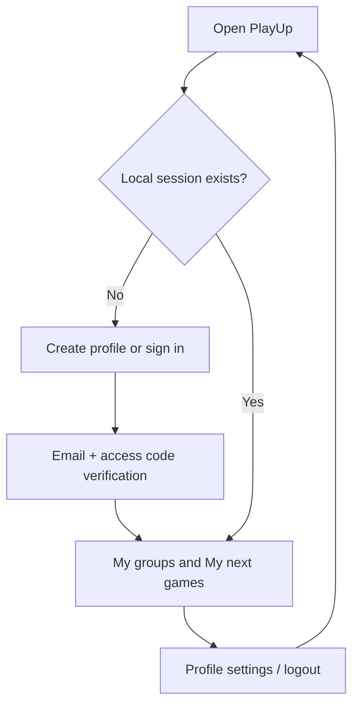
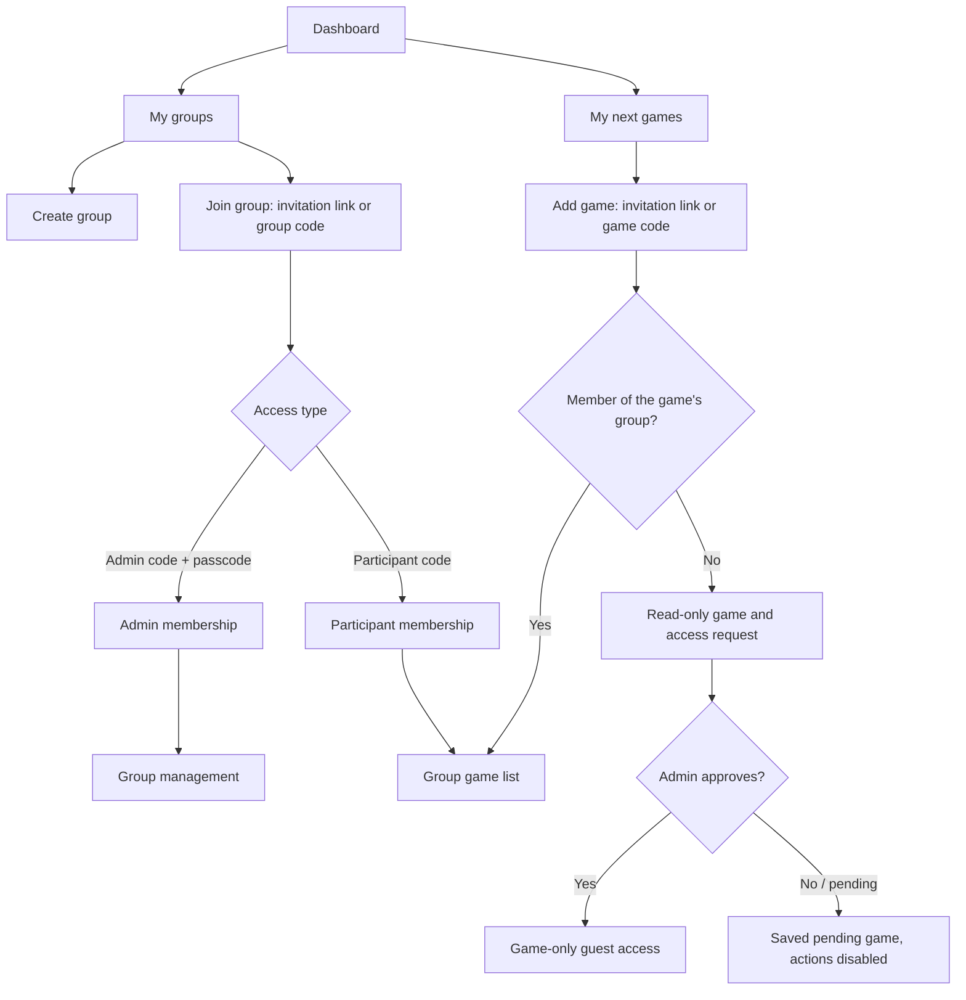
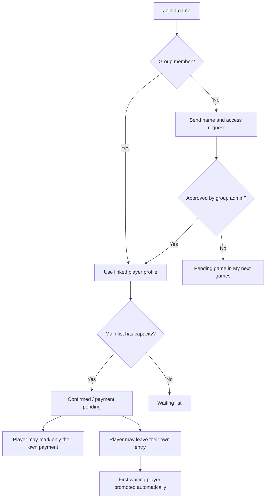

# PlayUp application flow

**Português:** [resumo em português](#resumo-em-português). This is the product-flow companion to the backend schema.

## Entry and profile

The current front end demonstrates email verification with code `123456` in local storage. The backend replaces this with a real email and session flow. Logout clears the local session; a future sign-in restores the account data from the backend.

## Groups and game access

There is no global “admin account” mode. A user can be an admin in Group A, a participant in Group B, and have guest-only access to Game C.

## Authority inside a group

| Capability | Group admin | Group participant | Guest |
| --- | --- | --- | --- |
| View active group games | Yes | Yes | Only their approved game |
| Create a game | Yes | Yes | No |
| Edit/delete group or see statistics | Yes | No | No |
| Maintain group player directory and attributes | Yes | No | No |
| Manage any group game | Yes | No | No |
| Manage a game created by themselves | Yes | Yes | No |
| Join/leave own game entry and update own payment | Yes | Yes | Only after approval |

When a participant creates a game, the game records `createdByUserId` and `createdByRole: participant`. The creator becomes that game’s organizer only. They can create players, add/remove players in that game, mark payments, and balance teams. They do **not** become a group admin, cannot see player skill attributes, cannot see group statistics, and cannot manage games created by someone else. A group admin retains full management of every game in the group.

## Game roster flow

Names are unique case-insensitively within a group and an active game list. A group member joins immediately; no admin approval is required. A guest never gains group membership from game approval.

## Team balancing

1. Only **paid, confirmed main-list players** are eligible. Waiting-list and unpaid players are excluded.
2. At least two eligible players are required for manual balancing.
3. A full, fully paid main list automatically creates the next available standard balance.
4. For an admin-created game, automatic and manual balances share a quota of **two** standard balances. For a participant-created game, that quota is **one**.
5. Changing the roster or payment state clears the active team snapshot but never restores a spent balance quota.
6. Once the standard quota is spent, exactly one final manual rebalance becomes available in the final 15 minutes before kickoff. It can be used once.
7. The latest balance replaces the previous snapshot and status message. The algorithm favors a different comparably fair split rather than only switching the two team labels.

Admin-created games show the latest trigger, the responsible admin when relevant, and the balance count. Participant-created games hide player skill data and admin identities.

## Completed and cancelled games

- Finished and cancelled games use read-only presentation for every role.
- Finished games retain their last valid team snapshot.
- A finished, non-cancelled game increments participation statistics once for each confirmed main-list player.
- Only an authorized group admin may delete a historical game.

## Resumo em português

1. A pessoa cria/entra no perfil por e-mail e código de acesso. No protótipo, isso é local e usa `123456`.
2. O painel unifica **Meus grupos** e **Meus próximos jogos**. Uma pessoa pode ser admin de um grupo, participante de outro e guest de um jogo específico.
3. Grupo pode ser acessado por link/código: convite de admin exige senha; convite de participante não. Jogo pode ser acessado por link/código sem entrar no grupo; nesse caso o usuário vê o jogo e solicita acesso.
4. Admin administra o grupo inteiro. Participante também pode criar um jogo, mas vira organizador somente daquele jogo: lista, pagamentos, criação de jogadores e times. Não ganha estatísticas, atributos técnicos nem administração do grupo ou de outros jogos.
5. Membro do grupo entra direto no jogo com o próprio perfil; se estiver cheio, vai para espera. Guest só entra após aprovação. Cada pessoa altera apenas o próprio pagamento e sai apenas da própria vaga.
6. Balanceamento usa apenas jogadores confirmados e pagos. Jogo de admin tem duas gerações regulares; jogo criado por participante tem uma. Depois existe apenas um rebalanceamento manual final, liberado nos últimos 15 minutos antes do jogo. Mudanças na lista não reiniciam os limites.
